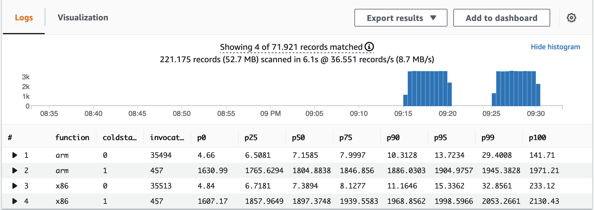

# AWS Lambda Custom Runtime (based on JRE 17) to test the [AWS Lambda Java Runtime Interface Client (RIC)](https://github.com/aws/aws-lambda-java-libs/tree/master/aws-lambda-java-runtime-interface-client) on x86 and ARM
An AWS Lambda custom runtime to enable Java 17 support on a minimalistic JRE, which only includes the Java modules required by this function.

## Getting started

1. Download or clone the repository.  

2. install prerequisite software:  

  a) Install [AWS CDK](https://docs.aws.amazon.com/cdk/latest/guide/getting_started.html)  
  b) Install [Docker](https://docs.docker.com/get-docker/)  

3. Build and package the AWS Lambda function and create the AWS Lambda custom runtime for x86 and ARM using Docker:

```bash
./build-lambda-custom-runtime-with-lambda-ric.sh
```

4. Provision the AWS infrastructure (mainly Amazon API Gateway, AWS Lambda and Amazon DynamoDB) using AWS CDK:

```bash
./provision-infrastructure.sh
```

The API Gateway endpoint URL is displayed in the output and saved in the file `infrastructure/target/outputs.json`. The contents are similar to:

```
{
  "LambdaCustomRuntimeMinimalJRE17InfrastructureStack": {
    "apiendpoint": "https://<API_ID>.execute-api.<AWS_REGION>.amazonaws.com"
  }
}
```


## Using Artillery to load test the changes

First, install prerequisites:

1. Install [jq](https://stedolan.github.io/jq/) and [Artillery Core](https://artillery.io/docs/guides/getting-started/installing-artillery.html)
2. Run the following two scripts from the projects root directory:

```bash
artillery run -t $(cat infrastructure/target/outputs.json | jq -r '.LambdaCustomRuntimeRICInfrastructureStack.apiendpoint') -v '{ "url": "/custom-runtime-x86" }' infrastructure/loadtest.yml
artillery run -t $(cat infrastructure/target/outputs.json | jq -r '.LambdaCustomRuntimeRICInfrastructureStack.apiendpoint') -v '{ "url": "/custom-runtime-arm" }' infrastructure/loadtest.yml
```


### Check results in Amazon CloudWatch Insights

1. Navigate to Amazon **[CloudWatch Logs Insights](https://console.aws.amazon.com/cloudwatch/home?#logsV2:logs-insights)**.
2.Select the log groups `/aws/lambda/lambda-custom-runtime-ric-arm` and `/aws/lambda/lambda-custom-runtime-ric-x86` from the drop-down list
3. Copy the following query and choose **Run query**:

```
filter @type = "REPORT"
| parse @log /\d+:\/aws\/lambda\/lambda-custom-runtime-ric-(?<function>.+)/
| stats
count(*) as invocations,
pct(@duration, 0) as p0,
pct(@duration, 25) as p25,
pct(@duration, 50) as p50,
pct(@duration, 75) as p75,
pct(@duration, 90) as p90,
pct(@duration, 95) as p95,
pct(@duration, 99) as p99,
pct(@duration, 100) as p100
group by function, ispresent(@initDuration) as coldstart
| sort by function, coldstart
```

You see results similar to:



## Security

See [CONTRIBUTING](CONTRIBUTING.md#security-issue-notifications) for more information.

## License

This library is licensed under the MIT-0 License. See the LICENSE file.
